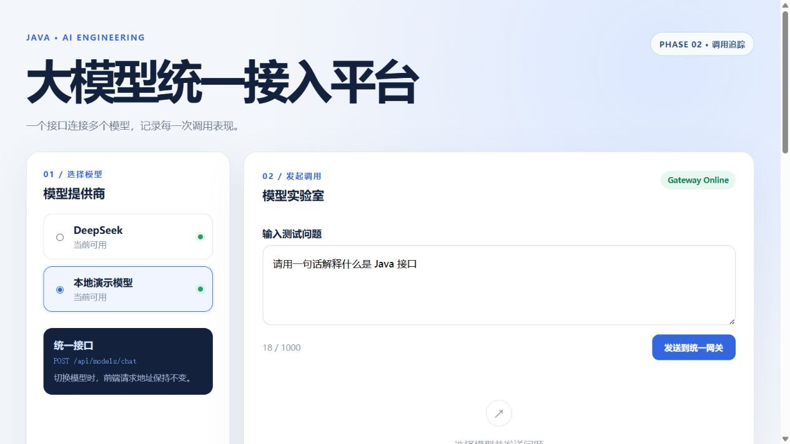
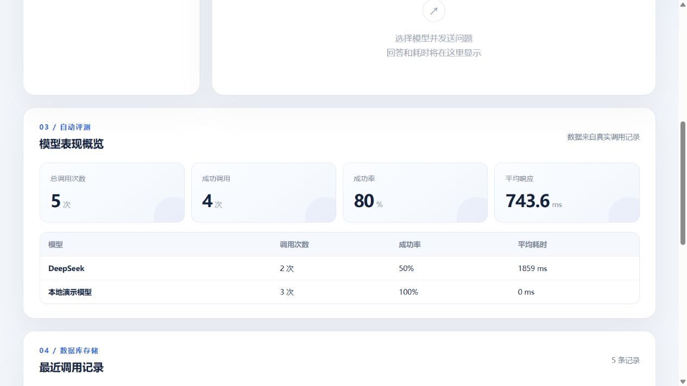
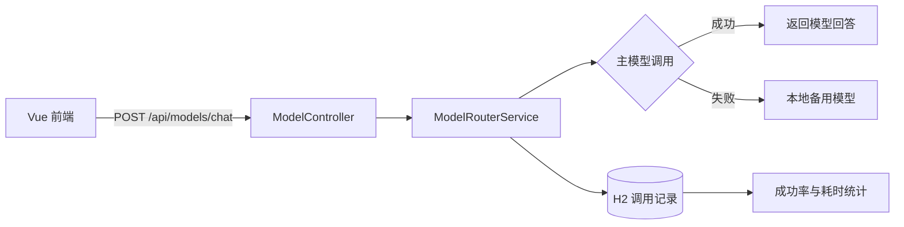

# 大模型统一接入与评测平台

[](https://github.com/766lan-sketch/llm-gateway-evaluation-platform/actions/workflows/ci.yml)

一个基于 Java 与 Vue 开发的大模型网关实践项目。前端只调用一个统一接口，后端负责选择模型、记录调用结果、统计模型表现，并在主模型异常时自动切换备用模型。





## 项目亮点

- **统一模型接口**：通过 `ModelProvider` 抽象不同模型，前端切换模型时不需要修改请求地址。
- **真实大模型接入**：使用 Java `HttpClient` 调用 DeepSeek Chat Completions API，并通过环境变量管理 API Key。
- **调用记录持久化**：使用 Spring Data JPA 与 H2 保存问题、回答、模型、耗时、状态及错误信息。
- **自动评测统计**：计算总调用数、成功率、平均响应耗时，并按模型展示调用表现。
- **故障自动降级**：主模型调用失败后自动切换本地备用模型，同时分别记录失败与降级结果。
- **接口保护与链路追踪**：聊天接口采用固定窗口限流；每次请求返回 `X-Request-ID`，便于从客户端问题定位到服务端日志。
- **自动化质量门禁**：后端包含路由、限流与请求追踪测试，GitHub Actions 自动执行 Maven 测试和 Vue 构建。
- **容器化交付**：前后端提供多阶段 Docker 构建与 Compose 编排，可用一条命令启动完整系统。
- **前后端分离**：后端提供 RESTful API，Vue 页面完成模型选择、提问、结果展示和评测看板。

## 技术栈

| 模块 | 技术 |
| --- | --- |
| 后端 | Java 21、Spring Boot、Spring Data JPA、Bean Validation |
| 数据库 | H2 文件数据库 |
| 大模型 | DeepSeek API、Java HttpClient |
| 前端 | Vue 3、Vite、原生 Fetch API |
| 工程化 | Maven、npm、Docker Compose、GitHub Actions |

## 系统流程



## 项目结构

```text
llm-gateway/
├─ backend/                 # Spring Boot 后端
│  └─ src/main/java/.../
│     ├─ controller/        # 接收 HTTP 请求
│     ├─ service/           # 模型路由、降级和评测逻辑
│     ├─ provider/          # DeepSeek 与本地模型实现
│     ├─ entity/            # 调用记录实体
│     ├─ repository/        # 数据库访问层
│     └─ dto/               # 接口请求与响应对象
├─ frontend/                # Vue 前端
│  └─ src/
├─ docs/                    # README 展示图片
└─ README.md
```

## 接口说明

| 方法 | 地址 | 作用 |
| --- | --- | --- |
| GET | `/api/models` | 查询可用模型列表 |
| POST | `/api/models/chat` | 使用指定模型发送问题 |
| GET | `/api/models/calls` | 查询最近 20 条调用记录 |
| GET | `/api/models/stats` | 查询调用成功率、平均耗时及模型对比 |

聊天接口默认限制同一客户端每分钟 20 次请求。响应头会返回
`X-RateLimit-Limit`、`X-RateLimit-Remaining` 和 `X-Request-ID`；超过限制时返回 HTTP `429`。

聊天请求示例：

```json
{
  "model": "deepseek",
  "question": "请用一句话解释什么是 Java 接口"
}
```

## 本地启动

### 1. 准备环境

- JDK 21
- Maven 3.9+
- Node.js 22.12+（或满足 Vite 要求的 20.19+）
- DeepSeek API Key（可选；未配置时仍可使用本地演示模型）

### 2. 配置 DeepSeek API Key

PowerShell 当前窗口临时配置：

```powershell
$env:DEEPSEEK_API_KEY="你的_API_Key"
```

Windows 用户环境变量长期配置：

```powershell
setx DEEPSEEK_API_KEY "你的_API_Key"
```

长期配置后需要重新打开终端。不要把真实 Key 写入 `application.properties` 或提交到 GitHub。
也可以复制根目录的 `.env.example` 为 `.env`，再填写本地配置。

### 3. 启动后端

```powershell
cd backend
mvn spring-boot:run
```

后端默认地址：`http://localhost:18083`

### 4. 启动前端

```powershell
cd frontend
npm install
npm run dev
```

浏览器访问：`http://localhost:5175`

## Docker 一键启动

已安装 Docker Desktop 时，在项目根目录执行：

```powershell
docker compose up --build
```

启动完成后访问 `http://localhost:5175`。数据库保存在名为 `gateway-data` 的 Docker Volume 中。

如需接入 DeepSeek，请先在当前终端配置 `DEEPSEEK_API_KEY`；也可以通过
`GATEWAY_RATE_LIMIT_MAX` 和 `GATEWAY_RATE_LIMIT_WINDOW_SECONDS` 调整限流参数。

## 自动化验证

```powershell
cd backend
mvn test

cd ../frontend
npm ci
npm run build
```

仓库中的 `.github/workflows/ci.yml` 会在每次推送和 Pull Request 时执行同样的检查。

## 数据说明

H2 数据库默认保存在 `backend/data/`。该目录属于本地运行数据，已加入 `.gitignore`，不会上传到 GitHub。

## 自动降级说明

本地备用模型是固定规则的演示实现，不是第二个真实大模型。这里的“评测”是调用成功率和耗时统计，尚不包含回答质量评测。

当 DeepSeek API Key 缺失、网络异常或接口调用失败时，网关会：

1. 保存主模型失败记录；
2. 使用相同问题调用本地备用模型；
3. 保存备用模型成功或失败记录；
4. 在响应中通过 `fallbackUsed` 和 `notice` 告知前端发生了自动降级。

## 后续计划

- 增加 SSE 流式输出；
- 使用 MySQL 替换学习阶段的 H2；
- 将单机限流升级为 Redis + Lua 分布式限流，并增加接口缓存；
- 增加用户登录、模型配置管理和自动化测试。

## 说明

本项目为个人学习与求职展示项目，重点练习 Java 后端分层、第三方 API 接入、数据持久化、运行监控和异常容错。
